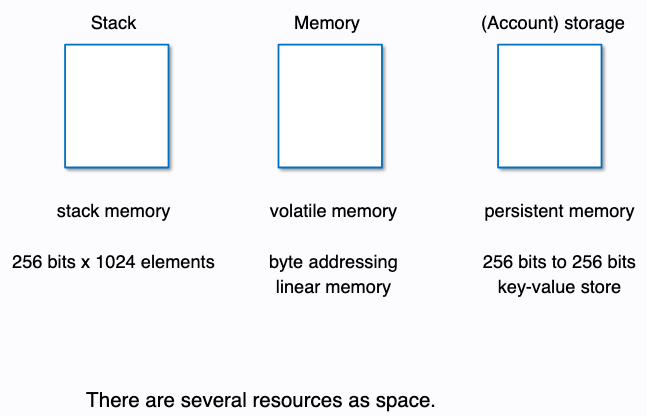

# Aave Flash Loans

<figure><figcaption></figcaption></figure>

We will learn how to take a Flash Loan from [Aave](https://aave.com/) and utilize this new concept in DeFi which doesn't exist in the web2 world.&#x20;

There is no good analogy for this from the traditional finance world, since this is simply impossible outside blockchains.

### 🏦 Traditional Banking Systems?

How do traditional banking systems work? If you want a loan you have to put forward a collateral against which you can take the loan. This is typically how lending/borrowing in DeFi also works.

However, you may need just a shit ton of money at times to execute some sort of attack that you cannot possibly provide collateral for, perhaps to execute a huge arbitrage trade or attack some contracts.

### 📸 What are Flash Loans?

You might be thinking: Is it some kind of loan? Well, yes, it is.&#x20;

It's a special type of loan where a borrower can borrow an asset as long as they return the borrowed amount and some interest **before the end of the transaction**.&#x20;

Since the borrowed amount is returned back, with interest, in the same transaction, there is no possibility for anyone to run away with the borrowed money.&#x20;

**If the loan is not repaid in the same transaction, the transaction fails overall and is reverted.**

This simple, but fascinating, detail is what allows you to borrow billions with no upfront capital or collateral, because you _need_ to pay it back in the same transaction itself.&#x20;

<mark style="color:orange;">However, you can go wild with that money in between borrowing it and paying it back.</mark>

Remember that all of this happens in one transaction 👀

### 🈸 Applications of a Flash Loan

They help in arbitrage between assets, causing liquidations in DeFi lending protocols, often play part in DeFi hacks, and other use cases. You can essentially use your own creativity to create something new 😇

In this tutorial we will only focus on how a `Simple Flash Loan` works which includes being able to borrow one asset. There are alternatives where you can borrow multiple assets as well. To read about other kinds of flash loans, read the documentation from [Aave](https://docs.aave.com/developers/guides/flash-loans)

Let us try to go a little deep on one use case, which is arbitrage. What is arbitrage? Imagine there are two crypto exchanges - A and B. Now A is selling a token `LW3` for a lower price than B. You can make profits if you buy `LW3` from A in exchange for DAI and then sell it on B gaining more DAI than the amount you initially started with.

Trading off price differences across exchanges is called arbitrage. Arbitrageurs are a necessary evil that help keep prices consistent across exchanges.

### 🤔 How do Flash Loans work?

There are 4 basic steps to any flash loan. To execute a flash loan, you first need to write a smart contract that has a transaction that uses a flash loan. Assume the function is called `createFlashLoan()`. The following 4 steps happen when you call that function, in order:

* Your contract calls a function on a Flash Loan provider, like Aave, indicating which asset you want and how much of it
* The Flash Loan provider sends the assets to your contract, and calls back into your contract for a different function, `executeOperation`
* `executeOperation` is all custom code you must have written - you go wild with the money here. At the end, you approve the Flash Loan provider to withdraw back the borrowed assets, along with a premium
* The Flash Loan provider takes back the assets it gave you, along with the premium.

<figure><figcaption></figcaption></figure>

If you look at this diagram, you can see how a flash loan helped the user make a profit in an arbitrage trade.&#x20;

* Initially, the user started a transaction by calling lets say a method **`createFlashLoan` ** in your contract which is named as **`FlashLoan Contract`**.&#x20;
* When the user calls this function, your contract calls the **`Pool Contract`** which exposes the liquidity management methods for a given pool of assets and has already been deployed by **Aave**.&#x20;
* When the **`Pool Contract` ** receives a request to create a flash loan, it calls the **`executeOperation` ** method on your contract with the **DAI **<mark style="color:purple;">****</mark> <mark style="color:purple;"></mark><mark style="color:purple;">in the amount user has requested</mark>.&#x20;
  * <mark style="color:orange;">**Note that the user didn't have to provide any collateral to get the DAI**</mark>, he just had to call the transaction and that **`Pool Contract`** <mark style="color:red;">requires you to have</mark> the **`executeOperation` ** method for it to send you the DAI
* Now in the **`executeOperation`** method after receiving the DAI, you can call the contract for `Exchange A` and buy some `LW3` tokens from all the DAI that the **`Pool Contract`** sent you.
* After receiving the **`LW3 Tokens`** you can again swap them for DAI by calling the `Exchange B` contract.
* &#x20;By this time now your contract has made a profit, so it can allow the **`Pool Contract`** to withdraw the amount which it sent our contract along with some interest and return from the **`executeOperation` ** method.
* Once our contract returns from the **`executeOperation` ** method, the **`Pool Contract`** has allowance to withdraw the DAI it originally sent along with the interest from our **`FlashLoan Contract`**, so it withdraws it.
*   User can now withdraw profits from the contract after the transaction is completed.


* It has been suggested by Aave to withdraw the funds after a successful arbitrage and not keep them long in your contract because it can cause a `griefing attack`. An example has been provided [here](https://ethereum.stackexchange.com/questions/92391/explain-griefing-attack-on-aave-flash-loan/92457#92457).

<mark style="color:green;">**All this happens in one transaction, if anything is not satisfied during the transaction like for example our contract fails in doing the arbitrage, remember everything will get reverted and it will be as if our contract never got the DAI in the first place. All you would have lost is the gas fees for executing all this.**</mark>

### 🔨Contract

Lets build an example where you can experience how we can start a flash loan. Note we won't be actually doing an arbitrage here, because finding profitable arbitrage opportunities is the hardest part and not related to the code, but will essentially just learn how to execute a flash loan.

> NOTE: Just like hedge funds protect their trading strategies, protecting arbitrage opportunities is important for arbitrageurs. If those opportunities are made public, they really aren't opportunities anymore as someone is always willing to 'do it cheaper' driving the profit margin to essentially zero.

**Setup a Hardhat project**

```shell
mkdir flash-loan
cd flash-loan
npm init --yes
npm install --save-dev hardhat @nomicfoundation/hardhat-toolbox

# bootstrap the hardhat project
npx hardhat
```

Make sure you select **`Create a Javascript Project`** and then follow the steps in the terminal to complete your Hardhat setup.

Install **`@openzeppelin/contracts and aave`**&#x20;

```shell
npm install @openzeppelin/contracts @aave/core-v3 dotenv
```

Create a new file inside the **`contracts`** directory and call it **`FlashLoanExample.sol`**

```solidity
// SPDX-License-Identifier: MIT
pragma solidity 0.8.10;

import "@aave/core-v3/contracts/flashloan/base/FlashLoanSimpleReceiverBase.sol";
import "@openzeppelin/contracts/token/ERC20/IERC20.sol";

contract FlashLoanExample is FlashLoanSimpleReceiverBase {
    event Log(address asset, uint256 val);

    constructor(IPoolAddressesProvider provider)
        FlashLoanSimpleReceiverBase(provider)
    {}

    function createFlashLoan(address asset, uint256 amount) external {
        address receiver = address(this);
        // use this to pass arbitrary data to executeOperation
        bytes memory params = ""; 
        uint16 referralCode = 0;

        POOL.flashLoanSimple(receiver, asset, amount, params, referralCode);
    }

    function executeOperation(
        address asset,
        uint256 amount,
        uint256 premium,
        address initiator,
        bytes calldata params
    ) external returns (bool) {
        // do things like arbitrage here
        // abi.decode(params) to decode params

        uint256 amountOwing = amount + premium;
        IERC20(asset).approve(address(POOL), amountOwing);
        emit Log(asset, amountOwing);
        return true;
    }
}
```

Now let's try to decompose this contract and understand it a little better.

When we declared the contract we did it like this `contract FlashLoanExample is FlashLoanSimpleReceiverBase {...}`, our contract is named `FlashLoanExample` and it is inheriting a contract named `FlashLoanSimpleReceiverBase` which is a contract from [Aave](https://github.com/aave/aave-v3-core/blob/master/contracts/flashloan/base/FlashLoanSimpleReceiverBase.sol) which you use to setup your contract as the receiver for the flash loan.

Now after declaring the contract, if we look at the constructor, it takes in a provider of type `IPoolAddressesProvider` which is essentially the address of the `Pool Contract` we talked about in the example above wrapped around an interface of type `IPoolAddressesProvider`.&#x20;

**This interface is also provided to us by Aave and can be found** [**here**](https://github.com/aave/aave-v3-core/blob/master/contracts/interfaces/IPoolAddressesProvider.sol)**.**&#x20;

**`FlashLoanSimpleReceiverBase`** requires this provider in its constructor.

```solidity
constructor(IPoolAddressesProvider provider)    
FlashLoanSimpleReceiverBase(provider)  
{}
```

The first function we implemented was `createFlashLoan` which takes in the asset and amount from the user for which he wants to start the flash loan.&#x20;

Now for the receiver address, you can specify the address of the `FlashLoanExample Contract` and we have no params, so let's just keep it as empty.&#x20;

For `referralCode` we kept it as 0 because this transaction was executed by user directly without any middle man.&#x20;

To read more about these parameters you can go [here](https://docs.aave.com/developers/core-contracts/pool).&#x20;

After declaring these variables, you can call the `flashLoanSimple` method inside the instance of the `Pool Contract` which is initialized within the `FlashLoanSimpleReceiverBase` which our contract had inherited, you can look at the code [here](https://github.com/aave/aave-v3-core/blob/master/contracts/flashloan/base/FlashLoanSimpleReceiverBase.sol#L19).

```solidity
    function createFlashLoan(address asset, uint256 amount) external {
        address receiver = address(this);
        // use this to pass arbitrary data to executeOperation
        bytes memory params = ""; 
        uint16 referralCode = 0;

        POOL.flashLoanSimple(receiver, asset, amount, params, referralCode);
    }
```

After making a `flashLoanSimple` call, `Pool Contract` will perform some checks and will send the asset in the amount that was requested to the `FlashLoanExample Contract` and will call the `executeOperation` method.&#x20;

Now inside this method you can do anything with this asset but in this contract we just give approval to the `Pool Contract` to withdraw the amount that we owe along with some premium. Then we emit a log and return from the function.

```solidity
    function executeOperation(
        address asset,
        uint256 amount,
        uint256 premium,
        address initiator,
        bytes calldata params
    ) external returns (bool) {
        // do things like arbitrage here
        // abi.decode(params) to decode params

        uint256 amountOwing = amount + premium;
        IERC20(asset).approve(address(POOL), amountOwing);
        emit Log(asset, amountOwing);
        return true;
    }
```

Now we will try to create a test to actually see this flash loan in action.

<mark style="color:orange;">**Now because**</mark><mark style="color:orange;">** **</mark><mark style="color:orange;">**`Pool Contract`**</mark><mark style="color:orange;">** **</mark><mark style="color:orange;">**is deployed on Polygon Mainnet,**</mark> we need some way to interact with it in our tests.

<mark style="color:purple;">We use a feature of Hardhat known as</mark> <mark style="color:purple;"></mark><mark style="color:purple;">`Mainnet Forking`</mark> <mark style="color:purple;"></mark><mark style="color:purple;">which can simulate having the same state as mainnet, but it will work as a local development network. That way you can interact with deployed protocols and test complex interactions locally.</mark>

**Note this has been referenced from the official documentation of** [**Hardhat**](https://hardhat.org/hardhat-network/guides/mainnet-forking.html)****

Update **hardhat.config.js** file

```javascript
require("@nomicfoundation/hardhat-toolbox");
require("dotenv").config({ path: ".env" });

const QUICKNODE_RPC_URL = process.env.QUICKNODE_RPC_URL;

/** @type import('hardhat/config').HardhatUserConfig */
module.exports = {
  solidity: "0.8.10",
  networks: {
    hardhat: {
      forking: {
        url: QUICKNODE_RPC_URL,
      },
    },
  },
};

```

You will see that we configured hardhat forking here, by instructing it to fork from the Quicknode RPC URL we provide.&#x20;

<mark style="color:orange;">**This will create a local fork of the Polygon blockchain from the block number when we run our tests - so our local fork will have all the data up until that point (i.e. liquidity in Aave pools) and then we can locally create new txns/blocks for our local fork.**</mark>

Install **`dotenv` ** package to be able to import the env file and use it in our config.&#x20;

Inside **`hardhat`** directory:

```shell
npm install dotenv
```

Create a `.env` file in the `flash-loans`folder and add the following lines

```python
QUICKNODE_HTTP_URL="<QUICKNODE-RPC-URL-FOR-POLYGON-MAINNET>"
```

Replace `QUICKNODE-RPC-URL-FOR-POLYGON-MAINNET` with the URL of the node for <mark style="color:purple;">**Polygon Mainnet.**</mark>

**Steps:**

1. **Create an account** in  [Quicknode](https://www.quicknode.com/?utm\_source=learnweb3\&utm\_campaign=generic\&utm\_content=sign-up\&utm\_medium=learnweb3)&#x20;
2. **`Create an endpoint`** on  [Quicknode](https://www.quicknode.com/?utm\_source=learnweb3\&utm\_campaign=generic\&utm\_content=sign-up\&utm\_medium=learnweb3)&#x20;
   * Select <mark style="color:orange;">**`Polygon`**</mark>, and then&#x20;
   * Select the <mark style="color:purple;">**`Mainnet`**</mark>network&#x20;
   * `Click`` `**`Continue` ** in the bottom right and then click on **`Create Endpoint`**
3. Copy the link given to you in **`HTTP Provider`** and add it to the **`.env`** file below for **`QUICKNODE_HTTP_URL`**

Create a **`config.js`**`in out project root`

```javascript
// Polygon Mainnet DAI Contract Address
const DAI = "0x8f3Cf7ad23Cd3CaDbD9735AFf958023239c6A063";
// Random user's address that happens to have a lot of DAI on Polygon Mainnet
// By the time you're doing this lesson, if this address doesn't have DAI on Polygon Mainnet,
// switch it out for someone else who does have a lot of DAI
const DAI_WHALE = "0xdfD74E3752c187c4BA899756238C76cbEEfa954B";

// Mainnet Pool contract address
const POOL_ADDRESS_PROVIDER = "0xa97684ead0e402dc232d5a977953df7ecbab3cdb";
module.exports = {
  DAI,
  DAI_WHALE,
  POOL_ADDRESS_PROVIDER,
};

```

If you look at this file, we have three variables - `DAI`, `DAI_WHALE` and `POOL_ADDRESS_PROVIDER`.&#x20;

`DAI` is the address of the `DAI` contract on polygon mainnet.&#x20;

`DAI_WHALE` is an address on polygon mainnet with lots of DAI and&#x20;

`POOL_ADDRESS_PROVIDER` is the address of the `PoolAddressesProvider` on polygon mainnet that our contract is expecting in the constructor.&#x20;

The address can be found [here](https://docs.aave.com/developers/deployed-contracts/v3-mainnet/polygon).

<mark style="color:orange;">Since we are not actually executing any arbitrage, and therefore will not be able to pay the premium if we run the contract as-is, we use another Hardhat feature called</mark> <mark style="color:orange;"></mark><mark style="color:orange;">**impersonation**</mark> <mark style="color:orange;"></mark><mark style="color:orange;">that lets us send transactions on behalf of</mark> <mark style="color:orange;"></mark>_<mark style="color:orange;">any</mark>_ <mark style="color:orange;"></mark><mark style="color:orange;">address, even without their private key.</mark>&#x20;

However, of course, this only works on the local development network and not on real networks. Using impersonation, we will steal some DAI from the `DAI_WHALE` so we have enough DAI to pay back the loan with premium.

Inside your **`flash-loans/test`** folder create a new file **`FlashLoanExample.js`**

```javascript
const { expect, assert } = require("chai");
const hre = require("hardhat");

const { DAI, DAI_WHALE, POOL_ADDRESS_PROVIDER } = require("../config");

describe("Flash Loans", function () {
  it("Should take a flash loan and be able to return it", async function () {
    const FlashLoanExample = await hre.ethers.getContractFactory(
      "FlashLoanExample"
    );

    // Deploy our FlashLoanExample smart contract
    const flashLoanExample = await FlashLoanExample.deploy(
      // Address of the PoolAddressProvider: you can find it here: https://docs.aave.com/developers/deployed-contracts/v3-mainnet/polygon
      POOL_ADDRESS_PROVIDER
    );
    await flashLoanExample.deployed();

    // Fetch the DAI smart contract
    const token = await ethers.getContractAt("IERC20", DAI);

    // Move 2000 DAI from DAI_WHALE to our contract by impersonating them
    const BALANCE_AMOUNT_DAI = ethers.utils.parseEther("2000");
    await hre.network.provider.request({
      method: "hardhat_impersonateAccount",
      params: [DAI_WHALE],
    });
    const signer = await ethers.getSigner(DAI_WHALE);
    await token
      .connect(signer)
      .transfer(flashLoanExample.address, BALANCE_AMOUNT_DAI); // Sends our contract 2000 DAI from the DAI_WHALE

    // Request and execute a flash loan of 10,000 DAI from Aave
    const txn = await flashLoanExample.createFlashLoan(DAI, 10000);
    await txn.wait();

    // By this point, we should have executed the flash loan and paid back (10,000 + premium) DAI to Aave
    // Let's check our contract's remaining DAI balance to see how much it has left
    const remainingBalance = await token.balanceOf(flashLoanExample.address);

    // Our remaining balance should be <2000 DAI we originally had, because we had to pay the premium
    expect(remainingBalance.lt(BALANCE_AMOUNT_DAI)).to.equal(true);
  });
});
```

Now let's try to understand whats happening in these lines of code.

First, using Hardhat's extended **`ethers` ** version

We call the function **`getContractAt` ** to get the instance of **DAI** deployed on Polygon Mainnet. Remember Hardhat will simulate Polygon Mainnet, so when you get the contract at the address of **`DAI` ** which you had specified in the **`config.js`**, Hardhat will actually create an instance of the DAI contract which matches that of Polygon Mainnet.

After that, the lines given below will again try to impersonate/simulate the account on Polygon Mainnet with the address from `DAI_WHALE`. Now the fascinating point is that even though Hardhat doesn't have the private key of `DAI_WHALE` in the local testing environment, it will act as if we already know its private key and can sign transactions on the behalf of `DAI_WHALE`. It will also have the amount of DAI it has on the polygon mainnet.

```javascript
    await hre.network.provider.request({
      method: "hardhat_impersonateAccount",
      params: [DAI_WHALE],
    });
```

Now we create a signer for `DAI_WHALE` so that we can call the simlulated DAI contract with the address of `DAI_WHALE` and transfer some `DAI` to `FlashLoanExample Contract`. We need to do this so we can pay off the loan with premium, as we will otherwise not be able to pay the premium. In real world applications, the premium would be paid off the profits made from arbitrage or attacking a smart contract.

```javascript
    const signer = await ethers.getSigner(DAI_WHALE);
    await token
      .connect(signer)
      .transfer(flashLoanExample.address, BALANCE_AMOUNT_DAI); 
```

After this we start a flash loan and checking that the remaining balance of `FlashLoanExampleContract` is less than the amount it initially started with, the amount will be less because the contract had to pay a premium on the loaned amount.

```javascript
    const txn = await flashLoanExample.createFlashLoan(DAI, 10000);
    await txn.wait();
    const remainingBalance = await token.balanceOf(flashLoanExample.address);
    expect(remainingBalance.lt(BALANCE_AMOUNT_DAI)).to.equal(true);
```

To run the test you can simply execute on your terminal:

```
npx hardhat test
```

If all your tests pass, then that means you successfully were able to borrow a loan of 10,000 DAI from Aave with no required collateral, and then paid back the 10k DAI + a premium.
