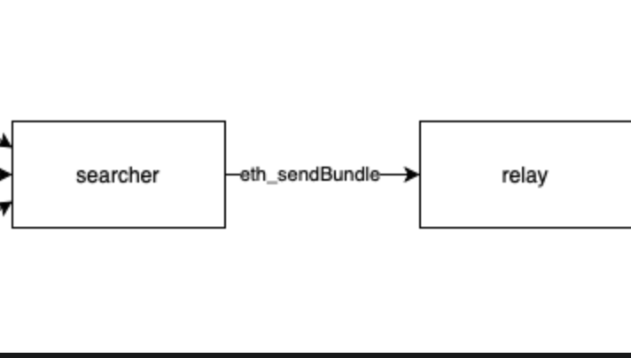

# Aave Flash Loans

<figure><figcaption></figcaption></figure>

We will learn how to take a Flash Loan from [Aave](https://aave.com/) and utilize this new concept in DeFi which doesn't exist in the web2 world.&#x20;

There is no good analogy for this from the traditional finance world, since this is simply impossible outside blockchains.

### 🏦 Traditional Banking Systems?

How do traditional banking systems work? If you want a loan you have to put forward a collateral against which you can take the loan. This is typically how lending/borrowing in DeFi also works.

However, you may need just a shit ton of money at times to execute some sort of attack that you cannot possibly provide collateral for, perhaps to execute a huge arbitrage trade or attack some contracts.

### 📸 What are Flash Loans?

You might be thinking: Is it some kind of loan? Well, yes, it is.&#x20;

It's a special type of loan where a borrower can borrow an asset as long as they return the borrowed amount and some interest **before the end of the transaction**.&#x20;

Since the borrowed amount is returned back, with interest, in the same transaction, there is no possibility for anyone to run away with the borrowed money.&#x20;

**If the loan is not repaid in the same transaction, the transaction fails overall and is reverted.**

This simple, but fascinating, detail is what allows you to borrow billions with no upfront capital or collateral, because you _need_ to pay it back in the same transaction itself.&#x20;

<mark style="color:orange;">However, you can go wild with that money in between borrowing it and paying it back.</mark>

Remember that all of this happens in one transaction 👀

### 🈸 Applications of a Flash Loan

They help in arbitrage between assets, causing liquidations in DeFi lending protocols, often play part in DeFi hacks, and other use cases. You can essentially use your own creativity to create something new 😇

In this tutorial we will only focus on how a `Simple Flash Loan` works which includes being able to borrow one asset. There are alternatives where you can borrow multiple assets as well. To read about other kinds of flash loans, read the documentation from [Aave](https://docs.aave.com/developers/guides/flash-loans)

Let us try to go a little deep on one use case, which is arbitrage. What is arbitrage? Imagine there are two crypto exchanges - A and B. Now A is selling a token `LW3` for a lower price than B. You can make profits if you buy `LW3` from A in exchange for DAI and then sell it on B gaining more DAI than the amount you initially started with.

Trading off price differences across exchanges is called arbitrage. Arbitrageurs are a necessary evil that help keep prices consistent across exchanges.

### 🤔 How do Flash Loans work?

There are 4 basic steps to any flash loan. To execute a flash loan, you first need to write a smart contract that has a transaction that uses a flash loan. Assume the function is called `createFlashLoan()`. The following 4 steps happen when you call that function, in order:

* Your contract calls a function on a Flash Loan provider, like Aave, indicating which asset you want and how much of it
* The Flash Loan provider sends the assets to your contract, and calls back into your contract for a different function, `executeOperation`
* `executeOperation` is all custom code you must have written - you go wild with the money here. At the end, you approve the Flash Loan provider to withdraw back the borrowed assets, along with a premium
* The Flash Loan provider takes back the assets it gave you, along with the premium.

<figure><figcaption></figcaption></figure>

